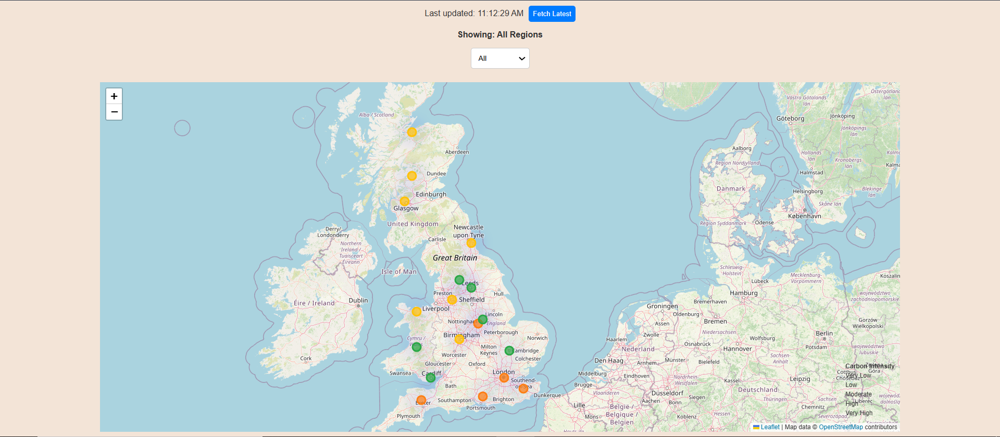
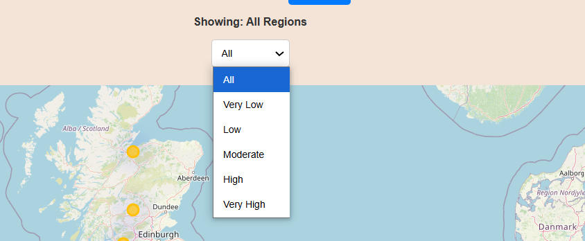
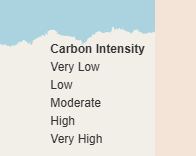

# Carbon Intensity Map

A React-based application to visualize carbon intensity across regions using Leaflet maps and React Query.

---

## Features
- Visualizes regional carbon intensity data on a map.
- Heatmap and markers for easy analysis.
- Filter by intensity levels (Very Low, Low, Moderate, High, Very High).
- Automatic periodic updates and manual refresh options.
- Error handling and user-friendly UI.

---

## Build and Run Instructions

### Prerequisites
- **Node.js** (v14+ recommended)
- **npm** or **yarn**

### Steps to Run Locally
1. Clone the repository:
   ```bash
   git clone <repository_url>
   cd <repository_directory>
   npm install
   npm start

## Screenshots
## Map View


 ## Filter Dropdown


 ## Legend


 ## Live Demo

 ## Credits

  ## API: ([Carbon Intensity API](https://carbon-intensity.github.io/api-definitions/#get-regional-regionid-regionid))
  ## Icons: ([Flaticon](https://www.flaticon.com/))
  ## Map: ([Leaflet](https://leafletjs.com/))